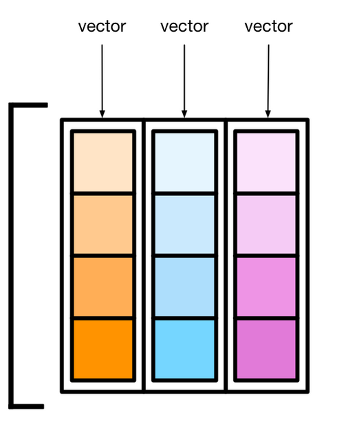

```{r setup, include=FALSE}
options(htmltools.dir.version = FALSE)
knitr::opts_chunk$set(
  fig.width=9, fig.height=3.5, fig.retina=3,
  out.width = "100%",
  cache = FALSE,
  echo = TRUE,
  message = FALSE, 
  warning = FALSE,
  hiline = TRUE
)
library(fontawesome)
```

```{r xaringan-themer, include=FALSE, warning=FALSE}
library(xaringanthemer)
style_duo_accent(
  primary_color = "#202c56",
  secondary_color = "#ac965a",
  inverse_header_color = "#FFFFFF",
  inverse_background_color = "#ac965a",
  base_font_size = "25px",
  text_font_size=  "1.45rem",
  link_decoration = "underline dotted red",
  code_font_size = "1.25rem",
  code_inline_color= "#003049",
  code_inline_background_color = "#FFFCFE",
  blockquote_left_border_color = "#003049"
  )

```

```{r xaringan-tachyons, echo=FALSE}
library(xaringanExtra)
xaringanExtra::use_tachyons()
```

```{r xaringan-animate-all, echo=FALSE, eval=TRUE}
xaringanExtra::use_animate_all("fade")
```

```{r xaringan-extra-styles, eval=TRUE, echo=FALSE}
xaringanExtra::use_extra_styles(
  hover_code_line = TRUE,     
)
```

```{r xaringan-scribble, echo=FALSE}
xaringanExtra::use_scribble()
```

```{r xaringan-editable, echo=FALSE}
xaringanExtra::use_editable(expires = 1)
```

```{r xaringanExtra-clipboard, echo=FALSE}
xaringanExtra::use_clipboard()
```

```{r html output, eval=TRUE, include=FALSE}
options(htmltools.dir.version = FALSE, htmltools.preserve.raw = FALSE)
```

```{css, echo = F}
.dk-section-title {
box-shadow: inset 0 0 0 1000px rgba(0,0,0,0.5);
}

.dk-section-title h1 {
  color: #f3f3f3;
  font-size: 100px;
  line-height: 1;
}

.smallcode .remark-code { /*Change made here*/
  font-size: 75% !important;
}

```


## Introducción

R como entorno y lenguaje de programación  

Objetos, funciones y paquetes

## Flujos de trabajo y análisis
Organización de proyectos  

Estructura y organización de datos


---

## Visualización de datos

Introducción a `ggplot2`  

Representaciones gráficas de información  

Preparación de figuras científicas  


---

.center[
 
]
---

## ¿Qué es `r fa(name = "r-project")`?

.can-edit[✍️Software]

--

¿Dialecto de S? 
¿Paquete estadístico? 
¿RStudio? 
¿Lenguage de programación? 
¿Dispositivo gráfico?

---

## ¿Quiénes usan `r fa(name = "r-project")`?

- Biólogos
- SAT
- Ministerio de Economía Argentino
- MS, Meta, Google, AT&T
- Equipos deportivos
- Etc.

https://bookdown.org/jboscomendoza/r-principiantes4/quien-usa-r.html

---

## `r fa(name = "r-project")`?

.pull-left[
.can-edit[✍️🧑‍🎓Ventajas]
]

.pull-left[
.can-edit[✍️🧑‍🎓Desventajas]
]

---

## Software libre y gratuito

.pull-left[
"_free_"

Gratis != Libre

]

  

> The whole R engine is open source so, if you wish, you can check
every line of it. If people were out to push dodgy software, this is not the way they’d go about it.

.tr[
Bill Venables, 2004
]

---

### Software libre y acceso al código fuente

.b[Libertad de:] 
    
.f4[
- Ejecutar el programa como se desee, con cualquier propósito.
- Estudiar cómo funciona el programa, y cambiarlo para que haga lo que se desee 
  
- Redistribuir copias para ayudar a otros
- Redistribuir copias de sus versiones modificadas para que la comunidad aproveche las modificaciones
]  

.tr[
[Open Software Foundation -General Public License](https://www.gnu.org/philosophy/essays-and-articles.html#principles)
]

---

# `r fa(name = "r-project")` no es `r fa(name = "registered")`studio

**IDE** - Entorno de desarrollo integrado

Herramientas para facilitar el uso de un lenguaje de programación
- Editor de texto que 'reconoce' la sintaxis de un lenguage  

- Atajos y herramientas para administrar y ejecutar código

---

  

.tr.f4[
Ruben Geert van den Berg  
https://www.spss-tutorials.com
]

---

## Scripts y código fuente

.pull-left[
  
]

Reproducir y modificar pasos  

Encontrar errores  

Documentar el proceso

Examinar código ajeno

---

# Principios de programación en R

.f2[
Todo lo que existe es un _objeto_  

Todo lo que ocurre lo hace una **función**  
   (_Las funciones son objetos_)

Las **funciones** (generalmente) viven en paquetes
]
---

## Objetos

- Tablas con filas y columnas

- Modelos

- Listas

- Gráficos

Todos los objetos tienen clases y atributos y hay distintas formas de crearlos

---

# 📦 Paquetes

Al instalar R instalamos: 

`base`:  las funciones más fundamentales de R

.can-edit[
✍️🧑‍🎓  
`list()`  
`log()`  
`cat()`
]


---

## Funciones

.code.f1[nombre.red[(]argumentos.red[)]]

.code.f1[promediar.red[(]20,12.red[)]]

Llamamos funciones por su nombre y entre paréntesis van los argumentos (con qué objeto trabajar y cómo)

---

### 📦 Paquetes

.pull-left[
Otros componentes de R-base:  
.f4[
`utils, stats, datasets, graphics, grDevices, grid, methods, tools, parallel, compiler, splines, tcltk, stats4`
]
]

.pull-right[
Paquetes 'recomendados' (se instalan con R pero no se cargan automáticamente)  

.f4[`boot, class, cluster, codetools, foreign, KernSmooth, lattice, mgcv, nlme, rpart, survival, MASS, spatial, nnet, Matrix`]
]

---

### 📦 Paquetes Adicionales

- más de 18,400 en [CRAN](https://cran.r-project.org/) (The Comprehensive R Archive Network) 

- muchos más en GitHub, GitLab, Bitbucket, Bioconductor, etc.


Se instalan desde R con:  

`install.packages()` para paquetes de CRAN  
`📦 remotes` para todos los demás repositorios

---

class: inverse

# Visita guiada por R y RStudio

- Ejecutar R 

- Ejecutar RStudio

- Instalar paquetes para hoy:

```{r, eval=FALSE}
install.packages("ggplot2")
install.packages("dplyr")
install.packages("openintro")
install.packages("gt")
install.packages("fs")
```

---
class: inverse, center, middle


# Antes de aprender sobre objetos y funciones:

---


# Sistemas de archivos

.fl.w-third[
  

.small[
Monica Chin (2021)  
[File not Found](https://www.theverge.com/22684730/students-file-folder-directory-structure-education-gen-z)
]
]

.fl.w-third[
  
.small[
Jody Macgregor (2021)  
[PC Gamer](https://www.pcgamer.com/students-dont-know-what-files-and-folders-are-professors-say/)
]
]

.fl.w-third[
  
]

---
background-image: url(imgs/escritorioadri.png)
background-size: contain

---

## Directorios, rutas y nombres

.fl.w-third[
  
.f5[Fuente: The Network Encyclopedia]
]

Guardar archivos en ubicaciones específicas, con nombres intencionales y útiles

- Nombres cortos e informativos


- Nombres que se puedan ordenar y que cooperen con búsquedas parciales

---

### Nombres

.fl.w-40[
### OK  
`max_temp`
</br>  
</br>
`prec_min_usd`  
`temp_mensual`  
]

.fl.w-60[
### No tanto  
`temperatura_maximaC20102014`  
`max`  
`temp`  
`'Precio Mínimo ($) USD'`  
`'Temperatura/Mes (°F)'`  
</br>
]
.tr[
Jenny Bryan (2015)  
[Naming Things](https://speakerdeck.com/jennybc/how-to-name-files)
]

---

### Organización de proyectos

.b[proyecto]: un directorio en su máquina que contiene todo los archivos relevantes para algún trabajo en particular

.f3[Separar:]

.f3[
 📁 Datos .f4[(o código para cargarlos de fuentes remotas)]  
 📁 _Scripts_ de análisis y/o visualización  
 📁 Salidas (figuras, informes, datos intermedios, etc.)
]

.pull-left[
Jenny Bryan (2017)  
[Project-oriented workflow](https://www.tidyverse.org/blog/2017/12/workflow-vs-script/)]

.pull-right[
Maëlle Salmon (2021)  
[Draw me a project](https://masalmon.eu/2021/06/30/r-projects/)
]

---

  

.b.f3.blue[Proyectos en RStudio]

- Instancia de R dedicada  

- Navegador apuntando al directorio del proyecto
  - botón para regresar al dir. del proyecto

- Dir. de proyecto establecido como Dir. de Trabajo
  - rutas relativas al Dir. de Proyecto

---

class: inverse

## Ejercicio

.f2[
Crear un proyecto para el curso en RStudio
- en alguna ubicación fácil de encontrar (ej. Escritorio)
- "cursoCNM-R" como nombre
]
---

## 📦 {`fs`}

Trabajando con el sistema de archivos (cualquier plataforma)

`fs` siempre trabaja con rutas ordenadas 

  -  '**`/`**' para delimitar carpetas  
  - Sin  '**`/`**' dobles o extras

.left-column[
Algunas funciones:
]

Crear directorios  
Mover archivos  
Copiar archivos  
Cambiar nombres  

---

class: inverse

# Ejercicio

- Crear nuevas carpetas en el directorio del proyecto  
  - datos
  - salida
  - R

### Los paquetes ya instalados se cargan con la función `library()`
```{r, eval=FALSE}
library(fs)
```

---

class: inverse

## Crear nuevas carpetas en el directorio del proyecto  

```{r, eval=FALSE}
dir_create("R")
dir_create("datos")
dir_create("salida")
dir_ls()
```

> Todo esto también se puede hacer desde el navegador de RStudio o el explorador del sistema operativo
---

### Guardar la fuente y no el entorno

.left-column[
  
]

.right-column[
- Exportar figuras y resultados a archivos

- Evitar `rm(list = ls())`. 
- 'Hoja en blanco' & reiniciar R seguido
]

.tr[
.f4[
Jenny Bryan & Jim Hester (2020)  
[What they forgot to teach you about R](https://rstats.wtf/save-source.html)  
Jenny Bryan (2018)    
[Zen And The aRt Of Workflow Maintenance](https://speakerdeck.com/jennybc/zen-and-the-art-of-workflow-maintenance)
]]

---

  

.f3.b.blue[Hoja en blanco (blank slate)]  

No se guarda el espacio de trabajo a un archivo .Rdata

No se carga el espacio de trabajo desde un archivo .Rdata al arrancar R

.f3.b.blue[Reiniciar R ]
 
Ctrl+Shift+F10  
 (Windows \ Linux)  
 
Command+Shift+F10 (Mac)

---

## 📦 .black[{here}] y rutas relativas

.f5[`F:\mi macbook\ruta\que\solo\tengo\mi-proyecto\analisis\script1.R`]

Trabajemos en relación a la raíz del proyecto con la función `here()`

- resuelve cuál es la raíz del proyecto
- construye rutas portátiles
- genera rutas absolutas (comienzan con `/`, `C:\` o `\\`)

.tr[
[Ode to the here package (2018)](https://github.com/jennybc/here_here)
]

---

class: middle
La raíz del proyecto es `mi-proyecto`

```{r, eval=FALSE}
here("analisis","script1.R")
```
contruye:  
  
.f5[`F:\mi macbook\ruta\que\solo\tengo\mi-proyecto\analisis\script1.R`]

---

.b[`here()`] no cambia el directorio de trabajo, solo construye rutas

.b[`here()`] resuelve cuál es la raíz de un proyecto (i.e. dónde está el archivo `.Rproj`?) y las rutas son relativas a ésto

http://jenrichmond.rbind.io/post/how-to-use-the-here-package/


---
class: dk-section-title
background-image:url("imgs/brigalow.jpg")
background-size: cover


# .white[Objetos]

---

.pull-left[
.f2.green[Vectores]  
  

.f2.green[Listas]

  
]


.pull-right[
.f2.green[Tablas]

  

]

---

## Vectores

Números
```{r}
c(1,2,3,4)
```

```{r}
c(22.1,0.006,4.1)
```

---

## Vectores

Caracteres

```{r}
c("perro","gato","rata","B")
```

---

## Vectores

Lógicos (verdadero/falso)

```{r}
c(TRUE,FALSE,FALSE,FALSE,TRUE)
```

---
.center[
  
]
---
.center[
  
]
---

# Creando objetos

```{r}
x <- c(1, 2, 3)
```

Función `c()` sirve para combinar valores en un vector

### ¿Qué pasó aquí?

---

# Operadores de asignación

.center[
.f1.code[<-]

.f1.code[=]
]

```{r}
x <- c(1, 2, 3)
```

---
```{r}
x <- c(1, 2, 3)
```

- Se creó un objeto (vector numérico con los valores 1,2,3)
- Se 'vinculó' el objeto con un **nombre**, `x`

.center[
..."crear un objeto "x" con los números 1,2,3"...
]
  

.tr[
https://adv-r.hadley.nz/names-values.html
]
---

```{r}
x <- c(1,2,3)
y <- c("a","G","h")
```

```{r}
x
y
```

---

## Los objetos tienen clases

```{r}
class(x)
class(y)
```

---

## Los vectores solo pueden tener objetos de la misma clase

```{r}
c(1,"a",2)
```

Al combinar caracteres y números hay conversión automática

---
## Vectores numéricos
  

---
## Factores

.pull-left[
  
]

Representan datos categóricos

Las etiquetas de cada valor se conocen como niveles, que pueden o no llevar un orden específico

Crear con `factor()`

---

### Factores

```{r}
factor(c("perro","gato","ave","ninguno",
         "perro","ninguno","perro","perro",
         "gato","ave","perro"))
```

---

## Dos o más vectores del mismo largo...

--
.pull-left[
  
]

### Data frame!

Objeto tabular con filas y columnas

Puede almacenar objetos de distintas clases en las columnas

Nombres para cada columna

---

## Data frames

Crear al importar un archivo tabular o con `data.frame()`

```{r}
mi_tabla <- 
data.frame(id=c("rana","pez","nutria","gusano"),
           ind_g=c(12,15,13,10),
           listo=c(TRUE,TRUE,FALSE,TRUE))

```

- cada vector es una columna
- nombres de columnas sin comillas
- mismo largo p/ todos los vectores

---
```{r}
mi_tabla
```

---

## Importando archivos (tablas)

- Con el botón "_Import Dataset_"
- Con alguna función `read`

.can-edit[
✍️🧑‍🎓   
read.tsv()  
read.csv()

]

---
class: inverse

# Ejercicio

Importar una tabla a R desde un archivo:

- 2 hojas de calculo
- 2 csv

Si necesitan inspiración:
https://vincentarelbundock.github.io/Rdatasets/

---

# `readr` y `readlx`

Paquetes adicionales para importar datos rectangulares desde archivos de texto y hojas de cálculo

- Menos errores al importar

- Mayor flexibilidad al leer archivos

- Lectura más rápida 

- Funciones adicionales para limpiar los valores en las columnas

---

class: dk-section-title
background-image:url("imgs/brigalow.jpg")
background-size: cover


# .white[`ggplot2`]
